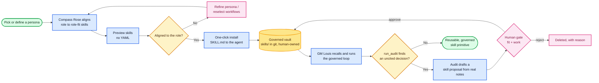

# Compass Rose — the skill lifecycle

How a skill enters an autonomous agent's governed vault. There are two doors and **one
gate**: a skill is either **authored** by a human from a persona (Compass Rose — the front
door) or **learned** from the agent's own decisions (the audit — the back door). Either way
it lands in `skills/` only through a human approval — *agents propose, humans promote.*

**Front door — Compass Rose (authoring).** Pick a saved persona or define a new executive
(CLI + 8 archetypes, or the no-YAML web app powered by GM Louis). Compass Rose aligns the role
to role-fit skills; you preview them and one-click install writes a `SKILL.md` the agent picks up.

**Back door — the competence engine (learning).** As GM Louis runs the governed loop,
`run_audit` finds uncited decisions and drafts a skill proposal from the agent's *own* notes —
the skills it should have written but didn't.

**One vault, one gate.** Authored or learned, every skill reaches `skills/` only through the
human gate's **fit + work** acceptance tests, as a git commit. `git revert` rolls a skill back —
behavior is revertible; the decision history that produced it is not.

---

Legend — 🟩 start / reusable primitive · 🟦 build step · 🟨 automatic decision ·
🟪 human · 🟧 governed vault.

Related: the decision/audit loop in the README (`## The loop`) and the full
[architecture diagram](architecture.svg).
